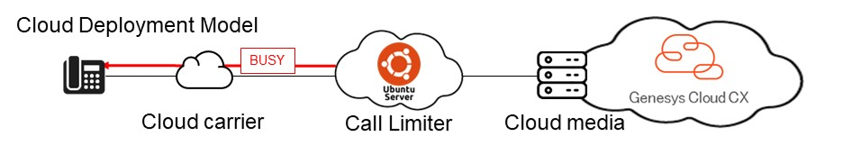
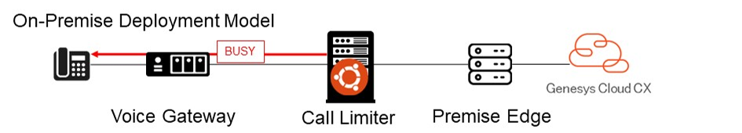
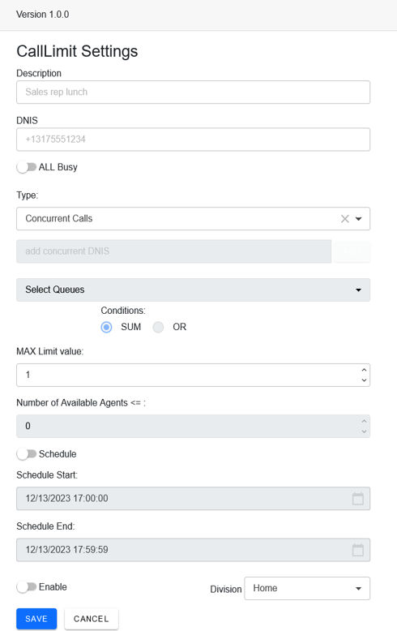

[]()
# Genesys Cloud CallLimiter

## 1. Overview

Genesys Cloud CallLimiter (hereafter referred to as CLM) is a SIP Proxy server that can send a SIP 486 BUSY signal to the cloud carrier or SIP voice gateway, based on configured number of concurrent calls or queue statistics in Genesys Cloud.


There are two deployment models.
1. Cloud deployment model  
The CLM is installed between the Cloud SIP carrier (e.g., Twilio/Vonage) and Genesys Cloud media (Cloud Edge).  
It runs on a public cloud environment such as AWS, GCP, or Azure.


1. On-premise deployment model  
The CLM is installed between the voice gateway (e.g., AudioCodes Mediant1000B) and the on-premise EDGE.


## 2. Features

- Send SIP 486 BUSY signal if the following conditions are met.
	- Send BUSY to all incoming calls
	- Number of concurrent calls
	- Number of concurrent calls with multiple DNIS
	- Number of waiting calls in specified queues
	- Number of interactions in specified queues
	- Sum of waiting calls + interactions in specified queues
	- Number of available agents in a specified queue
	- Schedule setting (specified date/time range)

- ANI BLOCK
- Call Details Report


## 3. System Requirement

1. Server  
Operating System: Ubuntu Server 22.04 LTS    
	Recommended Hardware:  
	- Hard Disk: 4GB or more  
	- Memory: 2GB or more
	- For AWS: `t2.small` instance or higher is recommended 

1. FQDN and trusted CA-signed certificate (Recommended)  
Self-signed server certificate will be created during installation.

## 4. Services and network information
| Service | Port | Purpose | External Communication |
|---|---|---|---|
| CallLimiter | 443 | Receive notification event from Genesys Cloud. | Yes |
| CallLimiterWeb | 443, 5000 | Provides the administration interface for this application. | Yes (Genesys Cloud) |
| nginx | 443 | Reverse proxy for CallLimiterWeb. | Yes |
| redis | 6379 | Stores real-time statistics and currently active configurations. | No |
| mariadb | 3306 | Store CLM settings,call details and phone numbers for ANI Block. | No |
| kamailio | 5060/5061 | SIP proxy<br>RTP packets do not flow through this server. | Yes |


## 5. Pre-requisites

1. Dedicated Ubuntu Server  
	* Version 22.04 LTS  
	* Global IP address is required for cloud deployment.
1. FQDN of this server if necessary
1. Genesys Cloud OAuth  
	1. Client Credentials to receive queue statics from Genesys Cloud  
		* Required role  
	`Analytics > Queue Observation > View`  
	1. Code Authorization for a Genesys Cloud user to logon to the administration interface  
		* Authorized redirect URIs  
`https://<Your CLM server IP Address or FQDN>/GCLogin/Index`  
		* Required Scope  
`organization:readonly`  
`routing:readonly`  
1. Genesys Cloud External trunk for CLM  
	1. Select protocol
	1. Set CLM server IP address in SIP Access Control
	1. Set your voice gateway IP address for outbound settings.  
Note: Do NOT set CLM IP address for outbound settings as CLM does not intervene in outbound calls.  
1. On-premise deployment model  
	* Add CLM trunk to your Edge servers
1. Firewall settings for cloud deployment  	
	1. Add all four SIP IP addresses of your region's BYOC Cloud address to your allowlist.
[https://help.mypurecloud.com/articles/byoc-cloud-public-sip-ip-addresses/](https://help.mypurecloud.com/articles/byoc-cloud-public-sip-ip-addresses/)
	1. Add your CLM server's public IP address to your carrier's access control allowlist.

## 5. Installation

1. Prepare the following values in this order before installation:  
	1. CLM server IP Address (use this in case automatic detection of installer fails)
	1. FQDN (if necessary)
	1. Your Genesys Cloud region  
	`e.g. mypurecloud.com`
	1. Genesys Cloud organization short name  
	`Admin >  Account Settings > Organization Settings > Short Name`
	1. Client Credentials ID and Secret
	1. Code Authorization ID and Secret
	1. EDGEs IP address  	
		* For Cloud Deployment  
	`e.g., myuniqueidentifier.byoc.mypurecloud.com`
		* For On-premise Deployment  
		`e.g., 172.10.10.10:5060` and comment `Edge#1  `
		`e.g., 172.10.10.11:5060` and comment `Edge#2`

1. Set up the Ubuntu server  
	* Download iso file from the following site, or set it up on your public cloud environment.  
[https://ubuntu.com/download/server](https://ubuntu.com/download/server)

1. Run install script  
	* The script file CLM_Install.sh contains all necessary steps to install CLM application.  
	
	```
	curl -sSL -o CLM_Install.sh https://raw.githubusercontent.com/tishige/GC_CallLimiter/main/Scripts/CLM_Install.sh && sudo bash CLM_Install.sh
	```
	* Paste the above values in response to each of the installer's prompts.  

4. Use your trusted CA-signed certificate  
	1. Copy the following files to your home directory
		- server.key  
		- server.crt  
		- ca.crt.  
	2. Open a terminal and switch to root user:
	```bash
	sudo -i
	```
	3. Create a backup of the current server.key file and then copy the new one from your home directory.  
	*Replace <your_username> with your actual username.*
	```bash
	cd /etc/ssl/private
	cp server.key backup-server.key  
	cp /home/<your_username>/server.key .  
	```
	4. Navigate to the /etc/ssl/certs directory:
	```bash
	cd /etc/ssl/certs
	```
	5. Create a backup of the current server.crt file and then copy the new one from your home directory
	```bash
	cp server.crt backup-server.crt  
	cp /home/<your_username>/server.crt .
	```
	6. Append the contents of the ca.crt file from your home directory to the existing ca.crt file in /etc/ssl/certs:
	```bash
	sudo bash -c "cat /home/<your_username>/ca.crt >> /etc/ssl/certs/ca.crt"
	```
	7. Restart the Nginx and Kamailio services
	```bash
	sudo systemctl restart nginx  
	sudo systemctl restart kamailio.service  
	```


## 6. How to use

1. Logon  
	1. Access to your CLM server URL with browser.  
`https://<YOUR CLM SERVER ADDRESS>/`  
Note: If you are using a self-signed certificate, a warning screen may be displayed. Select 'Continue'.
	1. Select Logon  
	1. You will be redirected to Genesys Cloud logon site.
	1. Logon to Genesys Cloud.  
	1. You will be redirected to CLM site.  
1. Change system limit mode
	1. Select the **GEAR** icon in the top right corner.
	1. Select System Limit Mode  

		| Mode | Feature |  
		|---|---|  
		| Unlimited | All inbound calls will be unconditionally connected to Genesys Cloud. |  
		| ALL BUSY | Send BUSY signal for all incoming calls. |  
		| DNIS | Send BUSY signal to a particular DNIS calls. |  

	1. Select **SAVE**
	1. Select **BACK**

1. Select **ADD NEW** button
	1. DNIS Call limit settings  

	  

| Categories | Options | Description |
|---|---|---|
| Description || Enter description of this configuration. |
| DNIS || Enter the DNIS for which you want to send out a BUSY signal. |
| All Busy || Send BUSY signal to all inbound calls to the specified DNIS.|
| Type | Concurrent Calls | Send a BUSY signal if the number of concurrent calls exceeds the MAX Limit Value. |
| | Concurrent Calls SUM | If the sum of concurrent calls from multiple DNIS exceeds the MAX Limit Value, send a BUSY signal. <br> - Add the other DNIS to the lower text box. <br>*Note:*<br>Calls received on the DNIS registered in the [add concurrent DNIS] box will only be counted towards the concurrent call count and, <br>will not be subject to the BUSY condition. |
| | Calls Waiting | If the number of waiting calls in specified queues exceeds the MAX Limit Value, send a BUSY signal.<br>Multiple queues can be specified from a list.<br>Choose between the SUM or OR conditions:<br>- SUM refers to the sum of waiting calls in the selected queue.<br>- OR refers to any of the selected queues.|
| | Queue Interactions | If the number of on-phone calls in specified queues exceeds the MAX Limit Value, send a BUSY signal.<br>- The condition is the same as above.|
| | Calls Waiting+<br>Interactions | If sum of waiting calls and on-phone calls in specified queues exceeds the MAX Limit Value, send a BUSY signal.<br>- The condition is the same as above.|
| | Queue Available Agents | If the number of available agents in specified queues is less than or equal to the Number of Available Agents Value, <br>send a BUSY signal.<br>- The condition is the same as above.<br>*Note:* <br>If you select multiple queues along with the total sum of available agents, the count of available agents is total available in queue1 + total available in queue2, even if some agents are in both queues.|
| Schedule | Start/End | This configuration will be enabled between the specified start and end times.<br>*Note:*<br> - The schedule does not support recurring settings.<br> - After the end of the schedule, the configuration becomes disabled but the status remains displayed as enabled. |
| Enable | | Switched to ON and the SAVE button is selected, a BUSY signal will be sent out if the specified conditions are met.|
| Division || Select the Genesys Cloud Division value. <br>People who belong to the selected division can see this configuration and the call details report for this DNIS.|

## 7. Use case

- If you need to immediately send a busy signal for a particular DNIS due to some trouble, select **'All Busy'** in a DNIS settings.
- You are using one DNIS to route calls to multiple queues through IVR, it's recommended to select **'Concurrent Calls'**.
- You have multiple DNIS with similar IVR flows connecting to one queue, **'Concurrent Calls SUM'** is recommended.

- You have separate DNIS for VIP members and regular members.  
	* If the number of calls at the VIP desk reaches a certain limit and you need to restrict calls to the regular desk,  
it is recommended to select **'Calls Waiting+Interactions'** or **"Queue Available Agents"**.  
	* Enter the DNIS for regular members and select the queues for VIP members.
- If you cannot assign agents during a particular time frame due to shift staffing, use the **Schedule** until sufficient agents are back.
- If you do not want the DNIS that your group is using to be visible to other groups, select **'Divisions'**.  
Note: Your group must be seperated by divisions in Genesys Cloud.

## 8. Limitations
1. Queue related  
	* When an incoming call reaches the Genesys Cloud side and the call state changes to waiting or on-phone, there is a minimum delay of 4 to 5 seconds before CLM detects it.  
	* The exact delay depends on your call flow until calls are either routed to a queue or connected to an agent.  
	* During this delay, CLM may not be able to send a BUSY signal to some incoming calls, resulting in these calls being connected.  
	* Unlike some other options, the 'Concurrent Calls' setting does not use Genesys Cloud's real-time statistics.  
	* If you want to more strictly limit the number of calls, please consider using the 'Concurrent Calls' option.
1. ANI block  
	* Regardless of the 'Limit mode' value, CLM sends a BUSY signal for incoming calls from ANIs registered on the ANI settings.
1. DNIS value  
	* For division awareness, a DNIS can only be assigned to one division.
	* If you enable the schedule, you can configure multiple settings for a DNIS. Otherwise, only one configuration can be set for a single DNIS.<br>

## 9. Test scenario  

- There are 100 call routes registered in Genesys Cloud, with each route (DNIS) mapped to a single queue, 1 to 1.

- The busy condition for each DNIS is set to Calls Waiting, with a Max Limit of 1.

- 50 calls are received from DNIS #1 to DNIS #50 and are placed in a waiting state in each queue, 1 - 50.

- An additional 100 calls are received from DNIS #1 to DNIS #100.

	- Due to the existing 50 calls still in a waiting state in queues 1 - 50, the calls from DNIS #1 to DNIS #50 receive BUSY.
	- Calls from DNIS #51 to DNIS #100 are able to be routed to each queue, 51 - 100, as there are no calls waiting in these queues.
  
	- Memory usage was approximately 750MB.

## 10. Database Backup and Restore Procedures

### Backup Database 
- On the CallLimiter Server, run **mysqldump** command and enter password.  
*Replace [filename] with your preferred value.*
	```
	mysqldump -u kamailio -p kamailio > [filename].sql
	Enter password:kamailiorw
	```

### Restore Database  
1. On the CallLimiter Server, run **mysql** command and enter password.  
*Replace [filename] with your actual value.*
	```
	mysql -u kamailio -p kamailio < [filename].sql
	Enter password:kamailiorw
	```
2. Open a browser and navigate to your CLM server URL.  
3. Select the **GEAR** icon in the top right corner.  
4. Select **RECOVERY** button under Redis Data Recovery.  

## 11. Add and Remove Edge Servers

### Add Edge Server(s)

1. On the CallLimiter Server, run the following **kamctl** command and enter DB password.  
	*Replace* \<EDGE IP ADDRESS\>:\<PORT\> & \<COMMENT\> *with your actual values.*
	```
	sudo kamctl dispatcher add 1 sip:<EDGE IP ADDRESS>:<PORT> 0 0 '' '<COMMENT>'
	MySQL password for user 'kamailio@localhost':kamailiorw
	```
	For example:
     
	```
	sudo kamctl dispatcher add 1 sip:172.10.10.12:5060 0 0 '' 'Indy_EDGE#2'
	sudo kamctl dispatcher add 1 "sip:myuniqueidentifier.byoc.mypurecloud.com:5061;transport=tls" 0 0 '' 'BYOC-C'
	```
2. Run the following **kamcmd** command to take effect. 
	```
	sudo kamcmd dispatcher.reload
	```
3. Run **kamcmd** command to check edge server connectivity.
	```
	sudo kamcmd dispatcher.list
	```
4. Check if **FLAGS** indicates `AP`  
	```
	Dest: {
             URI: sip:172.10.10.12:5060
             FLAGS: AP
             PRIORITY: 0
	```

### Remove Edge Server(s)

1. On the CallLimiter Server, run the following **kamctl** command to list current registered edge servers.  

	```
	sudo kamctl dispatcher show
	```
	Sample results
	```
	+----+-------+-------------------+-------+----------+-------+-------------+
	| id | setid | destination       | flags | priority | attrs | description |
	+----+-------+-------------------+-------+----------+-------+-------------+
	|  1 |     1 | sip:172.10.10.11  |     0 |        0 |       | Indy_EDGE#1 |
	|  2 |     1 | sip:172.10.10.12  |     0 |        0 |       | Indy_EDGE#2 |
	+----+-------+-------------------+-------+----------+-------+-------------+
	```
2. Find the `id` value of the edge server you want to remove.
3. Run the following **kamctl** command to remove your edge.  
	Replace `<id>` with your actual value.  
	```
	sudo kamctl dispatcher rm <id>
	MySQL password for user 'kamailio@localhost':kamailiorw
	```
4. Run the following **kamcmd** command to take effect.  
	```
	sudo kamcmd dispatcher.reload
	```